<h1 align="center">
    <a href="https://github.com/tehstun/displayables">
      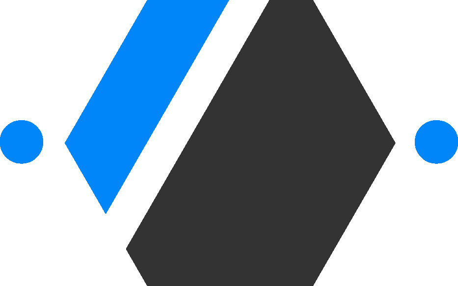
    </a>
    <br>Displayables<br>
    <a href="https://github.com/tehstun/displayables">
      
    </a>
</h1>

<h4 align="center">A configurable display based dashboard for creating content for unattended displays</h4>
<h5 align="center">University Web-Scripting Project 50%</h5>

<p align="center">
  <a>
    
    
    
    
  </a>
</p>

<p align="center">
  <a href="#key-features">Key Features</a> •
  <a href="#how-to-use">How To Use</a> •
  <a href="#supporting-features">Supporting Features</a> •
  <a href="#architecture">Architecture</a> •
  <a href="#architecture-rationale">Rationale</a> •
  <a href="#reflection">Reflection</a> •
  <a href="#license">License</a>
</p>

<div align="center">
    
</div>

# Key Features

- Multi-Provider Authentication
- Multi-Language Support
- Workstation based Components
- Server connection management
- Private workstation support
- Create, Delete and manage workstations.
- Contact support directly within the application.
- Workstation component drag and drop.
- Complete mobile support
- Public layout indexing
- Dynamics workstation content filling
- Full restful logging (errors included)
- High grade sha512 password encryption
- Workstation storage, validation
- Workstation publication management
- Third party API integrations
- Rate limiting
- User control and management
- Database generation and building on startup
- api/v1.0/users/example/workstations/1?fields=id,created (Dynamic field gathering)

# How to Use

### Installation

To clone and run this application, you'll need [Git](https://git-scm.com) and
[Node.js](https://nodejs.org/en/download/) (which comes with [npm](http://npmjs.com)) installed on
your computer. From your command line:

```bash
# Clone the repository
git clone https://github.com/tehstun/displayables.git

# Go into the repository
$ cd displayables

# Install dependencies
$ npm install

# Setup the application
$ npm run setup

# Run the app
$ npm start
```

Next you would be required to make a copy of the `.env.example` and rename it to `.env` making sure
to provide all the required api keys for the application as shown. The application will not run as
expected without these.

Additionally make sure to update the "google-signin-client_id" meta data within all the html files.

### Authenticating / Logging in

Authenticating can be done on the login page with the provided social platforms or after
registering.

<div align="center">
    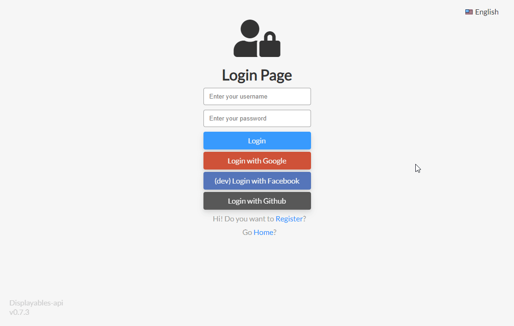
</div>

### Creating a new Workstation

Creating a workstation can be done from the 'all my layouts' section of the management page.
Clicking the small outlined box will result in a new workstation being added. If you have nine
workstations you will have to remove one before you can add again.

<div align="center">
    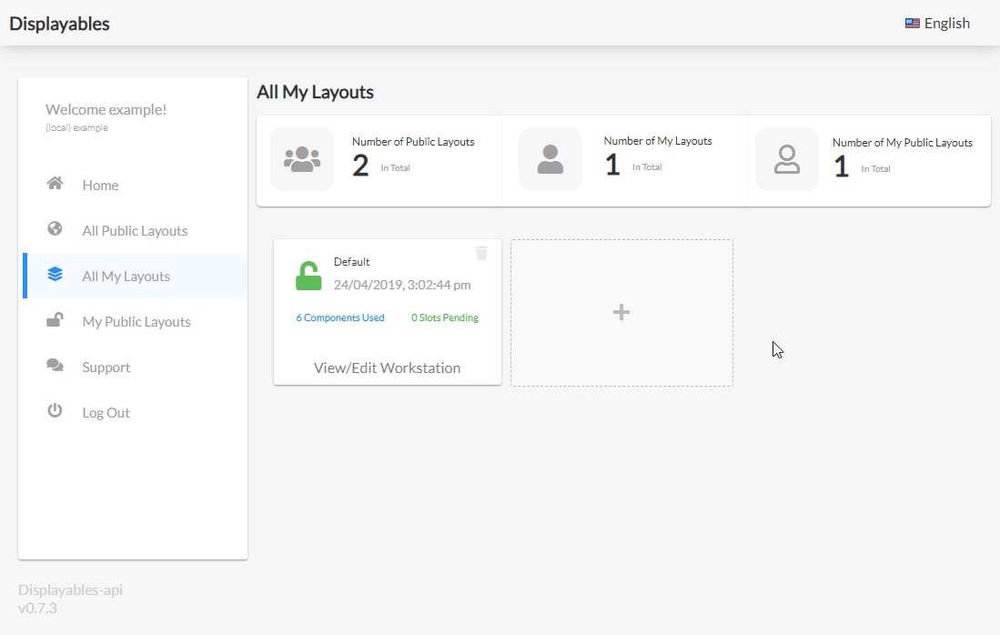
</div>

### Adding a Component (Desktop)

On Desktop you can drag a provided component onto a missing section of your workstation, this will
prompt the screen to provide the related information for the component. Clicking add will add it but
will not be saved util you click save.

<div align="center">
    
</div>

### Adding A Component (Mobile)

On mobile you cannot drag and drop, in this case tapping on a component will lead to the box to
provide the required information will show. A position selection dropdown will show above the rest,
this is the place on the workstation it will be shown.

<div align="center">
    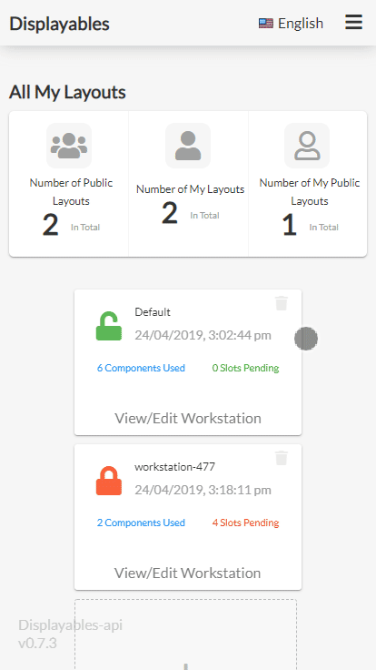
</div>

### Deleting a Component

Workstation components can be removed by simply clicking the delete button, making sure to save
afterwards (you will be prompted about unsaved changes otherwise).

<div align="center">
    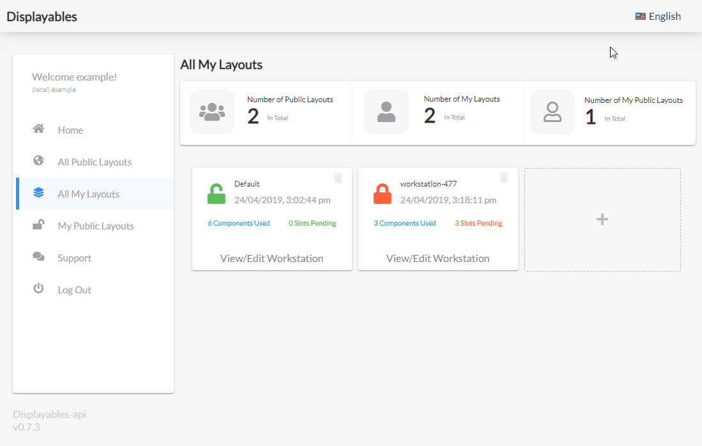
</div>

### Updating A Workstation's Name

Display name can be updated to help with quickly finding your workstation, this can be done within
the edit workstation page. Making sure to save.

<div align="center">
    
</div>

### Making A workstation public/private

Workstations can be made private or public, once public a user can find the workstation in the
public directory or by doing directly by the users username and workstation id. You can update it
from the management page or edit page.

<div align="center">
    
</div>

### Deleting A Workstation

Deleting a workstation can be done from the management page, doing so will remove all components and
remove all related data about the workstation.

<div align="center">
    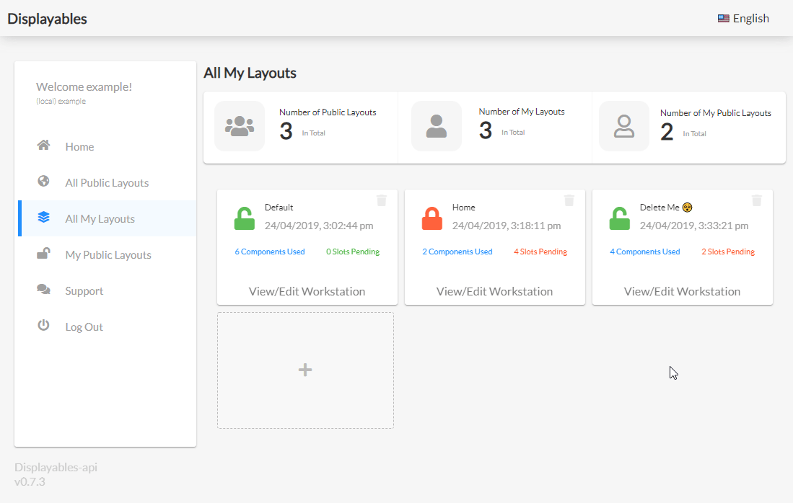
</div>

### Display information

Information is displayed at the top related to the global workstations and your workstations.

<div align="center">
    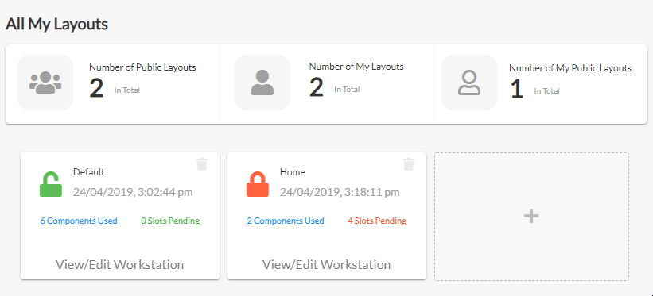
</div>

### Viewing All Public Workstations

All public workstations can be seen in the global registry on the home page or in the management
page under 'all public layouts'

<div align="center">
    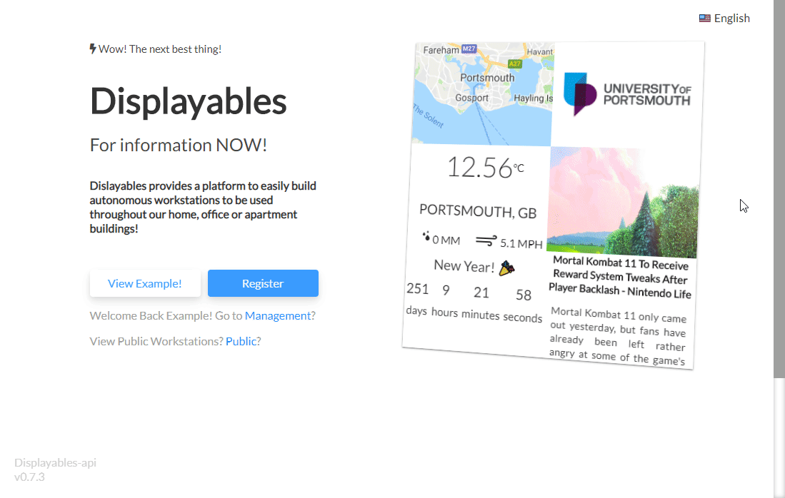
</div>

### Viewing Your Public Workstations

Your own public workstations can be viewed directly from your management page.

<div align="center">
    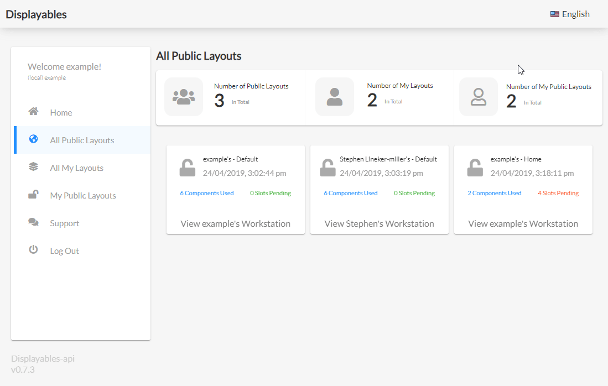
</div>

### Changing Display Language

Multiple languages are supported and can be adjusted from any page that is not directly the
workstations view. This can be found in the top right hand corner of the page.

<div align="center">
    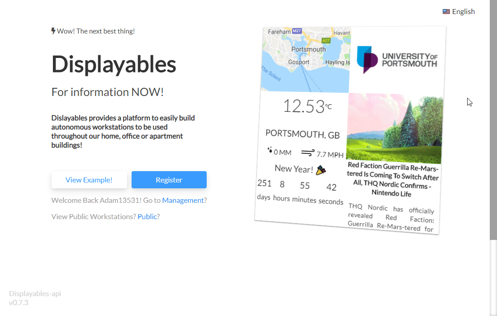
</div>

### Support Page

The support page can be used to provide feedback or questions in need of help. You will then be able
to adjust or submit the filled in google form.

<div align="center">
    
</div>

### Logging out

Logging out can be done on the management page or login page. You can only access the login page
again through url navigation as it cannot be done through clicking when already authenticated.

<div align="center">
    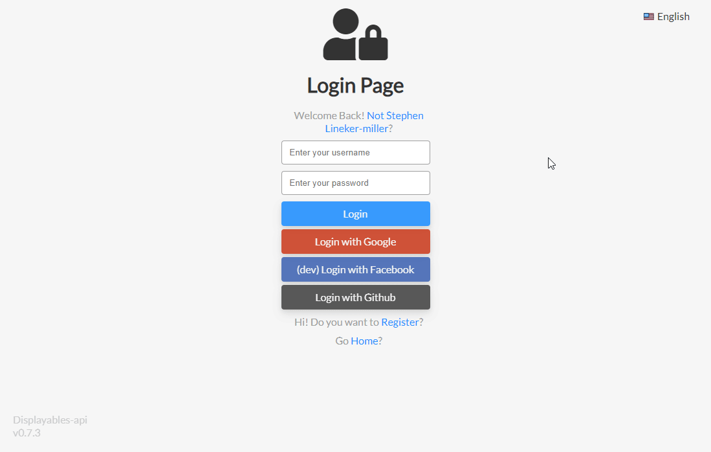
</div>

# Supporting Features

### Ownership Error

If you access a workstation when the workstation is private and you are not the owner of the
workstation then you will end up getting an ownership error, this message will allow you to let them
user know that they need to make it public (or you should not be viewing it).

<div align="center">
    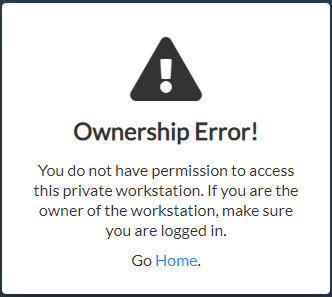
</div>

### Auto-Reconnecting

If and when you get disconnected from the server, the application will attempt to keep you connected
and update to date. When you are no longer communicating you will be shown a related connection
error and a reconnection when completed. Below is an example of disconnect and reconnect (gif).

<div align="center">
    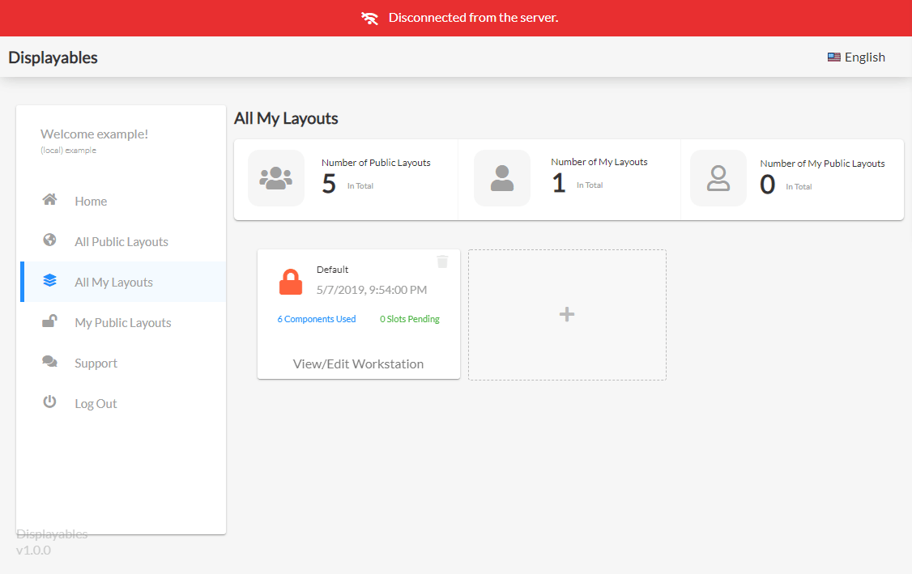
</div>

# Architecture

High-level design (HLD) explains the architecture that is being used for developing Displayables.
The architecture diagram provides an overview of an entire system, identifying the main components
that has been developed for the product.

<div align="center">
    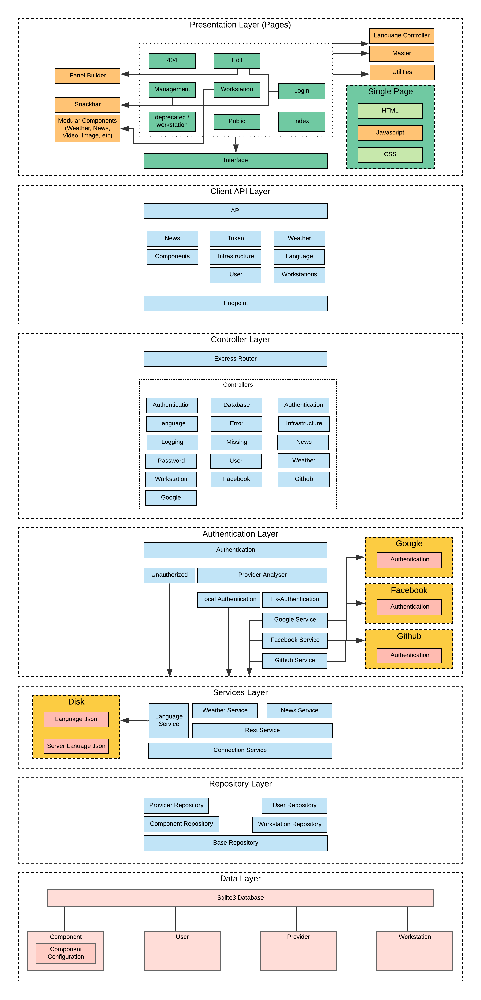
</div>

# Architecture Rationale

Based around the architectural design of MVC (Model View Controller), abstracting/decoupling the
user-interface, data and application to help seperate any related concerns of not being seperated.

### Presentation Layer

Each page has three common major components that are the backbone of the application, this being the
master, language and utilities files. This decision was made to reduce complexity within each pages
javascript. Isolating the core authentication management, global error handling and language
configuration.

### Client API

Having a dedicated implementation for the interface between client and server was decided early on
after seeing how overly complex the application will occur once the fetch statement is used
constantly without any real context. The client API design was to focus on implementing a standard
interface to the server while also allowing to understand what it's going no when you see a given
call. `api.weather.getWeatherByCity(...)` it's far more readable than an arbitrary fetch statement.

### Controller Layer

The controller design was used to split up each section into there own manageable controller of the
application, once again focusing on decoupling each section to reduce concerns about not being
separated. Each route having its own controller while adding some smaller controllers for
utility and logging reasons. Without this separation, the process of maintenance is far harder for
future developers.

### Authentication Layer

The authentication system became its own dedicated layer once the implementation of social media
authentication came into the system. It was important that when the developer tags the use of
authentication they can be sure if the route hits there method that the user is authenticated and
the user object exists. This layer is to ensure that happens or the request is rejected. Leading to
the controllers having no regard to if the user is authenticated or not, it can assume so if it made
it.

### Services Layer

The services layer is a high-level implementation of a service or services that can be used across
multiple controllers or other services. Service in this system will focus on machine
interaction and external API interfaces. The reasoning was the same as the client API, providing a
standard interface helps with future development, readability and development speed in the future.

### Repository Layer

Abstraction to raw SQL interfacing, all repository classes will focus around a couple but mainly a
single table within the given database. Use of methods would be used directly instead of query
statements from each controller. Keeping maintenance high by allowing method implementations to
change in the future without having to trigger changes all around the application. While also being
extendable.

### Data Layer

The decision to use a database was also decided early on, with the important focus to make sure that
the user's state is persisted for use on different platforms, devices. Not relying upon in-memory
content and having the current design means that the system can be scaled horizontally with minimal
database configuration changes.

# Reflection

View the <a href="./REFLECTION.md">REFLECTION.md</a> file.

# License

Displayables is licensed with a MIT License.
