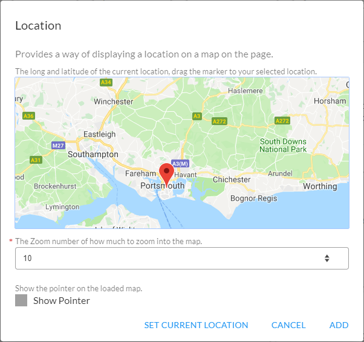

<h1 align="center">
    <a href="https://github.com/tehstun/displayables">
      
    </a>
    <br>Displayables<br>
    <a href="https://github.com/tehstun/displayables">
      
    </a>
</h1>

<h4 align="center">A configurable display based dashboard for creating content for unattended displays</h4>
<h5 align="center">University Web-Scripting Project 50%</h5>

<p align="center">
  <a href="#authentication-with-social-platforms">Social Authentication</a> •
  <a href="#decoupled-modules-components">Decoupling Components</a> •
  <a href="#extendable-client-api">Extendable client API</a> •
  <a href="#panel-builder">Panel Builder</a> 
</p>

# Reflection

Below is a selection of cases in which I encountered design or technology related concerns that
resulted in rethinking how to tactile the problem. Covering case information about the issues
occurred and my learnings/solution of solving the problems.

### Authentication with social platforms

When first attempting to setup authentication with external systems using OAuth I ran into a problem
which related attempting to keep a single point of entry for all authentication endpoints without
over-complicating or creating multiple endpoints for each social platform.

```bash
# Proposed implementation for client based social authentication methods.
# This would continue for the refreshing of the authentication.
http://localhost:8080/api/v1.0/google/login
http://localhost:8080/api/v1.0/facebook/login
http://localhost:8080/api/v1.0/github/login
http://localhost:8080/api/v1.0/login
```

To overcome this situation I implemented provider based parameters on the login endpoint,
redirecting traffic to the correct underlining implementation. All though slightly increasing
complication on the server it drastically improves the client based experience by not having to
implement every single social endpoint methods.

```bash
# implemented version of client based social authentication.
http://localhost:8080/api/v1.0/login?provider=google
http://localhost:8080/api/v1.0/login?provider=...

# implemented version of client based social refresh.
http://localhost:8080/api/v1.0/login/refresh?provider=google
http://localhost:8080/api/v1.0/login/refresh?provider=...
```

```javascript
switch (req.query.provider || req.headers.provider) {
case PROVIDERS.LOCAL:
    return await AuthenticationController.authenticateWithLocal(req, res, next);
case PROVIDERS.GOOGLE:
    return await AuthenticationController.authenticateWithGoogle(req, res, next);
default:
    return await AuthenticationController.authenticateWithLocal(req, res, next);
```

The server implementation will perform a based redirection on the provider to smaller sub-methods to
handle the authentication or refresh process. The end result is a simpler and easy to extend client
based authentication and easy to extend server side for adding more services as an option.

### Decoupled modules components

When first adding in the components that are being displayed on the workstation page, it was leading
to a single large workstation javascript file, This file containing all the methods for all the
different components (weather, map, countdown, etc). This was too large as more components were
being added and a better solution had to be created otherwise the file will be loaded when the only
1/3rd of the components where being used.

This lead down the path of decoupling the components into there own files with no importing of
external javascript files. Each file has a given start method that is exported and an optional
exported refresh method. Each component will be exposed to the instance data, language controller,
its name, API controller for communication and utilities before attending to start the component.

If the refresh export exists then the refresh method will be bound with the required refresh
information and pushed onto the refresh loop (to be called every n second to be updated if required,
determined by the component).

```javascript
const referenceName = `${configuration.name}-${classPosition}`;
const path = `/assets/js/components/${configuration.name}`;

workstationBase.components[referenceName] = Object.assign(await dynamicallyLoadScript(path), {
  instance: workstationBase.updateLoopData,
  language: workstationBase.lang.data,
  name: configuration.name,
  api: window.api,
  _: utilities
});

const componentRef = workstationBase.components[referenceName];

if (!utilities.isNil(workstationBase.components[referenceName].refresh)) {
  const refresh = componentRef.refresh.bind(componentRef, classPosition, config);
  workstationBase.updateLoop.push(refresh);
}

await componentRef.start(classPosition, config);
```

This resulted in a more decoupled system of components that are easily worked on without increasing
the complexity of the application. Improving application speed due to only loading in scripts that
are required for a given workstation.

_Unforseen Error (Browsers)_  
After the completion of this feature, I ran into an issue in which older browsers or some current up
to date browsers do not have support for this implementation or have it under an optional flag. This
lead to the requirement of having to listen out for the selected error and redirecting the user to
the older site. Forcing the support for an older layout for all future components until current
browsers implement dynamic importing.

```javascript
// the workstation page is using a special kind of method (dynamic import) to
// improve loading of the scripts, some browsers do not suport this so we should
// redirect the user to the supported page. We would recommend them to change
// the settings of firefox but this is not the best solution.
if (errorMessage.includes('syntaxerror') && location.pathname === '/workstation') {
  location.href = `${window.location.origin}/old/workstation${window.location.search}`;
}
```

### Extendable client API

When first making requests to the server I was constantly using the fetch keyword to perform async
based requests to and from the server to the client. All through this worked its leads to confusing
path queries and URLs that didn't help with reusability. Creating a user-friendly client that has
reusable methods and authentication caching was the way forward.

The client is broken up between each subsections of the endpoints (infrastructure, weather, users,
news, root, etc). Then each section uses predefined endpoint builders based on the extendable
Endpoint class.

```javascript
export default class Token extends Endpoint {
  /**
   * Creates a new instance o the Token class.
   * @param {string} apiUri The root url of the endpoint being called.
   * @param {string} path Any additional appended path (e.g /users)
   */
  constructor(apiUri, path) {
    super(apiUri, path);
  }

  /**
   * Creates a new user.
   * @param {string} username The username of the new user.
   * @param {string} password The password of the new user.
   */
  async create(username, password) {
    const options = Endpoint.buildOptions(this.apiUrl, `${this.path}register`, 'post', {
      username,
      password
    });

    return Endpoint.apiCall(options);
  }
}
```

Each method funnels down to a single api call after validation of content and building up the
request, with support for returning formatted messages and errors if they occurred. Tokens are set
during requests and authentication events are fired based on logging in or failing to
validate/refresh tokens.

```javascript
/**
 * Gets the news based on the provided country and category.
 * @param {string} country The country code of the news location.
 * @param {string | null} category The category of the news location.
 */
async function getNewsData(country, category) {
  if (this._.isNil(category)) return this.api.news.topCountry(country);
  return this.api.news.topCountryCategory(country, category);
}
```

This results in a highly extendable user based client that can be used throughout the application
constantly with the ability to quickly understand what the method call is doing. Which was the
target of having this client created. If any future case in which errors are occurring related to
the API calls, they only have to be changed within the client and not all over the application.

### Panel Builder

Due to the planned structure of the application, gathering the required information about each of
the components that would be added onto a workstation (e.g image, news, weather etc) would be
repetitive. Resulting in large amounts of duplicate code creating different input's and panels to
get user input which is not good for long term development.

To tackle this problem I put development time in creating a builder based class designed for
building and creating consistent looking panels with the ability to quickly swap out different kinds
of inputs easily. With the additional requirement of having the ability to quickly get a single
value or all values and update a value on the form (pre-loading information).

```javascript
panelBuilder
  .addInput('title', description, name, ...)
  .addDateInput('start_date', description, ...)
  .addTimeInput('start_time', description, ...)
  .addDateInput('end_date', description, ...)
  .addTimeInput('end_time', description, ...);

panelBuilder
  .addMapInput('map', description, ...)
  .addInputCounter('zoom', description, ...)
  .addCheck('show_pointer', name, description)
  .addButton(name, action);

...

panelBuilder.addCancelButton("Cancel");
panelBuilder.addButton("Add", callback);

panelBuilder.show();
```

<div align="center">
    
</div>

Applying an existing configuration to the panel (pre-filling editable information)

```javascript
Object.keys(component.configuration).forEach((key) => {
  panelBuilder.setInput(key, component.configuration[key]);
});
```

Having this ability meant that the time it takes to get another component implemented was even
smaller. Reducing the time to deployment for new components drastically. Due to how the panel was
implemented, gathering related values do not have to change with creating new panels, as the first
key value is which would be the object reference when getting the values.

```javascript
const values = panelBuilder.getAllValues();
```

The only problem that came up during the development process was the ability to enforce the required
properties. This was solved by allowing each type of input field have the option of being marked as
required. Required properties would be validated before executing the callback of the panel builder.
